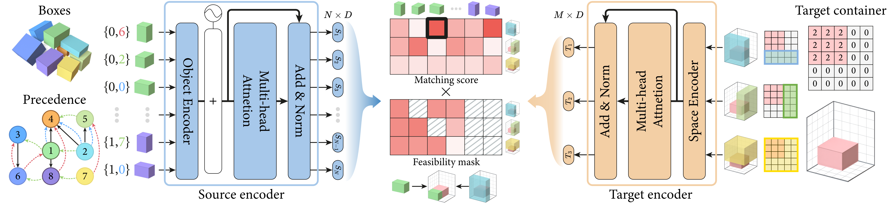

# Neural Packing: from Visual Sensing to Reinforcement Learning

<!-- [](https://opensource.org/licenses/MIT) -->
[](https://doi.org/10.1145/3618354)


<!-- 
<p align="center">
  
  <br>****
  Overview of the TAP-Net++ pipeline
</p> -->

This repository is the official implementation of the paper **"Neural Packing: from Visual Sensing to Reinforcement Learning"** (ACM Transactions on Graphics, SIGGRAPH Asia 2023). [arXiv link](https://arxiv.org/abs/2311.09233)

We propose **TAP-Net++**, a learning-based framework to solve the 3D Transport-and-Packing (TAP) problem. Unlike previous methods, our approach handles the full pipeline from visual sensing of casually stacked objects to robotic packing, optimizing both object selection and placement location (EMS) simultaneously.

For more details and materials, please refer to our [project page](https://vcc.tech/research/2023/TAPNet++).



## 🚀 Installation

### Prerequisites
- Python 3.8+
- PyTorch 1.10+
- CUDA 11.3+ (for GPU acceleration)
<!-- - **Blender 3.0+** (for visualization tools in `render/` directory) -->

### Dependencies
Install required packages:

**Option 1: Using requirements.txt**
```bash
pip install -r requirements.txt
```

**Option 2: Manual installation**
```bash
pip install torch
pip install gymnasium tianshou numpy matplotlib tqdm tensorboard scipy
```
<!-- 
**Note for visualization**: The `render/` directory uses Blender Python API (`bpy`) for 3D visualization. `bpy` comes with Blender installation and is not available via pip. To use visualization tools:
1. Install Blender from [blender.org](https://www.blender.org/download/)
2. Ensure Blender's Python includes the project dependencies
3. Or run visualization scripts within Blender's built-in Python environment -->

### Clone Repository
```bash
git clone https://github.com/Juzhan/Neural-Packing.git
cd Neural-Packing
```

## 🏃 Quick Start

### Training
To train the TAP-Net++ model with default parameters:

```bash
./train.sh
```

### Testing
To test a pre-trained model:

```bash
./test.sh
```

## 📖 Usage

### Command Line Arguments

The main training script `main.py` supports numerous configuration options:

```bash
python main.py --task tapnet/TAP-v0 \
                    --model tnpp \
                    --box-num 20 \
                    --container-size 100 100 100 \
                    --box-range 10 80 \
                    --fact-type tap_fake \
                    --prec-type attn \
                    --data-type rand \
                    --rotate-axes x y z \
                    --world-type real \
                    --container-type single \
                    --pack-type last \
                    --stable-predict 1 \
                    --reward-type C \
                    --max-epoch 100 \
                    --step-per-epoch 2000 \
                    --device cuda
```

### Key Parameters
- `--model`: Model architecture, 'tnpp' means tap-net++ (`tnpp`, `tn`, `greedy`)
- `--fact-type`: [Problem type](tap/envs/factory.py#L517) (`tap_fake` for precedence-aware, `box` for standard ordering packing)
- `--prec-type`: Precedence encoding (`attn`, `cnn`, `rnn`, `none`)
- `--data-type`: Data generation type (`rand` for random, `fix` for fixed, `ppsg` for Perfect Packing Strategy Guaranteed)
- `--rotate-axes`: Allowed rotation axes (`x`, `y`, `z` combinations, e.g., only `z` for 90-degree rotations around Z-axis)
- `--world-type`: Simulation type (`real` with stability, `ideal` without)
- `--container-type`: `single` or `multi` containers
- `--pack-type`: Packing strategy (`all` for all containers, `last` for last container only)
- `--stable-rule`: Stability rule (`hard_after_pack` for hard stability after packing)
- `--stable-predict`: Whether to predict stability (0 or 1)
- `--reward-type`: Reward formulation (`C` for compactness, `E` for each step reward, etc.)

## 🧠 Algorithm Overview

### TAP-Net++ Architecture

[TAP-Net++](models/network.py#L39) consists of three main components:

1. **[Object Encoder](models/encoder.py#L242)**: Encodes box dimensions and precedence relationships
2. **[Space Encoder](models/encoder.py#L177)**: Encodes Empty Maximum Spaces (EMS) for placement
3. **[Cross-Transformer](models/attention.py#L357)**: Learns interactions between objects and spaces

### Reinforcement Learning Formulation

- **State**: Box states, EMS, precedence masks, heightmaps
- **Action**: Joint selection of (box, rotation, EMS, corner)
- **Reward**: Compactness ratio, stability penalty, container count

## 📁 Code Structure

```
Neural-Packing/
├── main.py              # Main training script with argument parsing
├── test.sh                   # Shell script for testing
├── train.sh                  # Shell script for training
├── tap/                   # Core package
│   ├── __init__.py
│   ├── gym_tap.py            # Gymnasium environment registration
│   ├── envs/                 # Environment implementation
│   │   ├── __init__.py
│   │   ├── env.py            # Main TAP environment
│   │   ├── container.py      # Container management
│   │   ├── factory.py        # Box generation and management
│   │   ├── ems_tools.py      # EMS computation utilities
│   │   ├── convex_hull.py    # Geometry utilities
│   │   └── space.py          # Space representation
├── models/               # Neural network models
│   ├── __init__.py
│   ├── network.py        # Main TAP-Net++ architecture
│   ├── attention.py      # Cross-transformer implementation
│   ├── encoder.py        # Object and space encoders
│   ├── greedy.py         # Greedy baseline
│   └── old.py            # Legacy models [TAP-Net]
├── render/                   # Visualization tools
├── checkpoints/             # Saved model checkpoints
└── README.md               # This file
```
<!-- │   ├── render_scripts.py
│   ├── render_tools.py
│   ├── sim_tools.py
│   ├── tools.py
│   └── results/
│       └── plot.py          # Plotting utilities -->

## 🏋️ Training

### Training Process
1. **Environment Setup**: Creates vectorized environments for parallel training
2. **Data Collection**: Uses Tianshou's `Collector` to gather experience
3. **Policy Optimization**: Applies PPO/A2C updates with advantage estimation
4. **Checkpointing**: Saves best policies and periodic checkpoints

### Monitoring
Training progress can be monitored using TensorBoard:

```bash
tensorboard --logdir ./log
```

### Hyperparameters
Default training parameters (can be adjusted in `main.py`):
- Learning rate: 3e-4
- Buffer size: 2048
- Batch size: 128
- PPO clip epsilon: 0.2
- Discount factor (gamma): 0.99
- GAE lambda: 0.95

## 🧪 Testing
<!-- 
### Evaluation Metrics
- **Compactness ratio**: Volume utilization efficiency
- **Container count**: Number of containers used
- **Stability rate**: Percentage of stable placements
- **Completion rate**: Percentage of successfully packed objects -->

### Running Tests
```bash
python main.py --train 0 --resume-path ./checkpoints/policy.pth
```

## TAP Benchmark

### Benchmark Data Generation

We provide a data generation script to create benchmark datasets for evaluating TAP-Net++ performance across different data types. The script generates three types of box data:

1. **Random (rand)**: Randomly generated boxes within the specified size range
2. **Fixed (fix)**: Boxes sampled from a fixed set of candidate boxes
3. **Perfect Packing Strategy Guaranteed (ppsg)**: Boxes generated using perfect packing strategy

#### Generating Benchmark Data

Use the `gen_benchmark.py` script to create benchmark datasets:

```bash
python gen_benchmark.py --num-samples 100 --output-dir ./benchmark_data
```

This will generate 100 samples for each data type (rand, fix, ppsg) using default parameters from `main.py`:

- Container size: [100, 100, 100]
- Box range: [10, 80]
- Box number: 20
- Fact type: tap_fake
- Other parameters: Default values from main.py

#### Data Structure

Generated data is saved in the following directory structure:
```
benchmark_data/
├── tap_fake/
│   ├── rand/
│   │   └── 20/
│   │       └── [100_100]_[10_80]_10/
│   │           ├── 0_box.npy
│   │           ├── 0_pre.npy
│   │           ├── 1_box.npy
│   │           ├── 1_pre.npy
│   │           ├── ...
│   │           └── metadata.npy
│   ├── fix/
│   │   └── ...
│   └── ppsg/
│       └── ...
```

Each sample consists of:
- `{index}_box.npy`: Box dimensions (list of [width, length, height] for each box)
- `{index}_pre.npy`: Precedence graph for tap_fake fact type
- `metadata.npy`: Configuration metadata for the dataset


#### Customizing Data Generation

You can customize the data generation by modifying the script arguments:

```bash
# Generate only specific data types
python gen_benchmark.py --data-types rand fix

# Generate different number of samples
python gen_benchmark.py --num-samples 500

# Specify custom output directory
python gen_benchmark.py --output-dir ./my_benchmark_data
```

<!-- #### Using Benchmark Data

To use the generated benchmark data in training or evaluation, specify the `--fact-data-folder` argument in `main.py`:

```bash
python main.py --train 1 \
               --data-type rand \
               --fact-data-folder ./benchmark_data/tap_fake/rand/20/[100_100]_[10_80]_10
```

The environment will automatically load pre-generated data from the specified folder instead of generating new data on-the-fly. -->

<!-- #### Benchmark Evaluation

To evaluate models on the benchmark datasets, run:

```bash
python main.py --train 0 \
               --data-type rand \
               --fact-data-folder ./benchmark_data/tap_fake/rand/20/[100_100]_[10_80]_10 \
               --resume-path ./checkpoints/policy.pth
```

This ensures consistent evaluation across different runs and facilitates fair comparison between different model configurations. -->

<!-- ## 📊 Results


### Visualization
The `render/` directory contains tools for visualizing packing sequences and results. -->

## 🔗 Citation

If you find our work useful in your research, please cite:

```bibtex
@article{Xu2023NeuralPacking,
  title={Neural Packing: from Visual Sensing to Reinforcement Learning},
  author={Xu, Juzhan and Gong, Minglun and Zhang, Hao and Huang, Hui and Hu, Ruizhen},
  journal={ACM Transactions on Graphics (TOG)},
  volume={42},
  number={6},
  pages={Article 269},
  year={2023},
  publisher={ACM}
}
```

<!-- ## 📄 License

This project is licensed under the MIT License. See the LICENSE file for details. -->

<!-- ## 🙏 Acknowledgments

- Built on [Tianshou](https://github.com/thu-ml/tianshou) RL library -->
<!-- 
## ❓ FAQ

**Q: What's the difference between TAP-Net and TAP-Net++?**
A: TAP-Net++ extends TAP-Net with improved architecture, stability prediction, and multi-container support.

**Q: How do I visualize packing results?**
A: Use the scripts in the `render/` directory to generate visualizations.

**Q: Can I use this for real-world robotic packing?**
A: The framework is designed with real-world constraints in mind, but additional sensor integration may be needed for deployment.

**Q: What are the system requirements?**
A: 8GB+ RAM, GPU with 4GB+ VRAM recommended for training. Inference can run on CPU. -->
